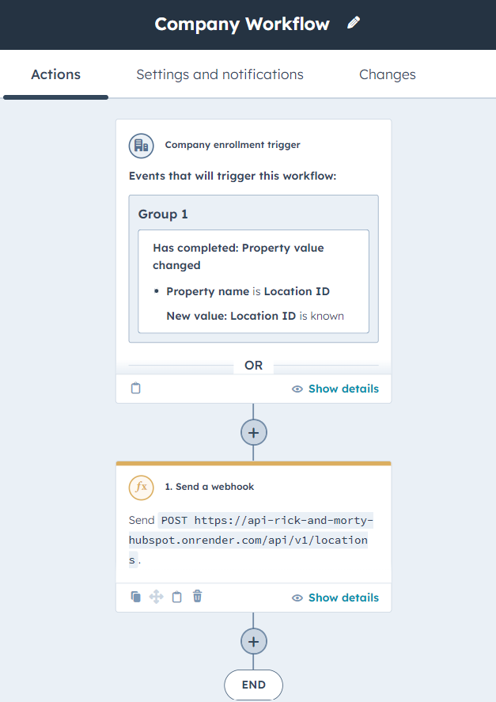

# BACKEND DEVELOPER TEST
In this repository we will find the solution to the challenge for the position of backend developer in the company on the fuze, then a brief summary of development

- Create the function to get the characters and locations from the rick and morty API.
- Migrate characters and locations from the Rick and Morty API to Husbpot as contacts and companies.
- Create association between contacts and companies.
- Integrate Hubspot whit this API to be able to create or update contacts and companies.
## RUN API
The first step to run the api you need to create a private app in hubspot, for this challenge i created the following application https://app.hubspot.com/private-apps/44229955/2921706 , after that copy the token and paste it in  database/private.json file

    {
        "name": "key",
        "key": "TOKEN_PRIVATE_API"
    }

the next step is to run api in a server or cloud, for this challenge use render and set it up like this
- General
	- Name: any for the server
	- Region: in this case use Oregon (US West)
- Build & Deploy
	- Repository: https://github.com/AndresCRR/On-The-Fuze
	- Branch: main
	-Root Directory:
	-Build Command: npm install
	-Start Command: npm run start

Finallly, the address of the service that was used is https://api-rick-and-morty-hubspot.onrender.com/

## MIGRATE DATA RICK AND MORTY API TO HUBSPOT
For migrate data of characters and locations from Rick and Morty API i created the next route in the server or api:

- /api/v1/characters
- /api/v1/locations
### MIGRATE CHARACTERS TO CONTACTS
#### GET CHARACTERS
- /api/v1/characters -> https://api-rick-and-morty-hubspot.onrender.com/api/v1/characters

I used the following code to obtain the characters. 
```javascript
const getAllAssociates = async () => {
  const allAssociatesSource = await associationContactCompany();
  return allAssociatesSource;
};
```
Where contacts is the variable i use to store the characters of Rick and Morty API and it is preloaded whit the server is run like this
```javascript
const url_character = "https://rickandmortyapi.com/api/character";
let contacts;
functionCharacters(url_character).then((data) => (contacts = data));
```
Where functionCharacters is the function created for get only the characters when the id is a prime number or 1
```javascript
function arrayPrimeNumber(number) {
  const array_number = [1];
  for (let n = 1; n <= number; n++) {
    let count = 0;
    for (let i = 1; i <= n; i++) {
      if (n % i === 0) count++;
    }
    if (count === 2) array_number.push(n);
  }
  return array_number;
}
//Function for call all characters from API Rick and Morty
async function functionCharacters(url) {
  // First call of characters ---> this call is to know the total characters
  const firstResponse = await fetch(url);
  const firstCharacters = await firstResponse.json();
  const total_characters = firstCharacters.info.count;
  const primeNumbers = arrayPrimeNumber(total_characters);
  // Second call of characters ---> this call is to capture the characters where the id is a prime number
  const response = await fetch(url + "/" + primeNumbers);
  const characters = await response.json();
  const data = characters.map((character) => {
    const fullName = character.name.split(" ");
    let firstName = "";
    let lastname = " ";
    if (fullName.length == 1) {
      firstName = fullName[0];
    } else {
      for (let i in fullName) {
        if (i == fullName.length - 1) {
          lastname = fullName[i];
        } else {
          firstName = firstName + fullName[i] + " ";
        }
      }
    }
    return {
      character_id: character.id,
      firstname: firstName.trim(),
      lastname: lastname,
      status_character: character.status,
      character_species: character.species,
      character_gender: character.gender,
      origin: character.origin.name,
    };
  });
  return data;
}
```
Finally, i used the following code to migrate the characters to contacts, where createCompany is the function created for migrate any company in source platform from Rick and Morty API.
```javascript
async function createContact(characters) {
  if (!characters) return;
  const allContactsSource = await hubspotClientSource.crm.contacts.getAll(
    undefined,
    undefined,
    ["lastname", "firstname", "character_id"]
  );
  const createContactSource = [];
  characters.map(async (character) => {
    const contactHsSource = allContactsSource.find(
      (data_contact) =>
        data_contact.properties.character_id == character.character_id
    );
    const contact = {
      properties: {
        character_id: character.character_id,
        firstname: character.firstname,
        lastname: character.lastname,
        status_character: character.status_character,
        character_species: character.character_species,
        character_gender: character.character_gender,
      },
    };
    if (!contactHsSource) {
      createContactSource.push(contact);
      const createContactResponseSource =
        await hubspotClientSource.crm.contacts.basicApi.create(contact);
    }
  });
  return createContactSource;
}
```
### MIGRATE LOCATIONS TO COMPANIES
#### GET LOCATIONS
- /api/v1/locations -> https://api-rick-and-morty-hubspot.onrender.com/api/v1/locations

I used the following code to obtain the locations.
```javascript
const getAllLocations = async () => {
  await createCompany(locations);
  return locations;
};
```
Where locations is the variable i use to store the locations of Rick and Morty API and it is preloaded whit the server is run like this
```javascript
const character = require("./Character");
let locations;
functionLocations(character.url_character).then((data) => (locations = data));
```
Where functionLocations is the function created for get all locations from Rick and Morty API.
```javascript
async function functionLocations(url_character) {
  const firstResponse = await fetch(url_character);
  const firstLocations = await firstResponse.json();
  const total_location = firstLocations.info.count;
  const endpointCharacter = character.arrayPrimeNumber(total_location);
  const endpointlocation = [];
  const response = await fetch(url_character + "/" + endpointCharacter);
  const characters = await response.json();

  characters.map((character) => {
    endpointlocation.push(character.location.url);
  });
  const locationUrls = endpointlocation
    .filter((n, index) => endpointlocation.indexOf(n) === index)
    .filter((url) => url != "");
  const locations = [];
  for (locationUrl of locationUrls) {
    const res = await fetch(locationUrl);
    const location = await res.json();
    locations.push(location);
  }
  const data = locations.map((location) => {
    return {
      location_id: location.id,
      name: location.name,
      location_type: location.type,
      dimension: location.dimension,
      creation_date: location.created,
    };
  });
  return data;
}
```
Finally, I used the following code to migrate the locations to companies where createCompany is the function created for create any company in source platform from Rick and Morty API.

```javascript
async function createCompany(companies) {
  if (!companies) return;
  const allCompaniesSource = await hubspotClientSource.crm.companies.getAll(
    undefined,
    undefined,
    ["name", "location_id"]
  );
  const createCompanySource = [];
  companies.map(async (company) => {
    const companieHsSource = allCompaniesSource.find(
      (data_companie) =>
        data_companie.properties.location_id == company.location_id
    );
    const location = {
      properties: {
        location_id: company.location_id,
        name: company.name,
        location_type: company.location_type,
        dimension: company.dimension,
        creation_date: company.creation_date,
      },
    };
    if (!companieHsSource) {
      createCompanySource.push(location);
      const createCompanyResponseSource =
        await hubspotClientSource.crm.companies.basicApi.create(location);
    }
  });
  return createCompanySource;
}
```

## ASSOCIATE CONTACTS TO COMPANIES
For associate contacts and companies in source platform i created the next route in the server or api:
- /api/v1/associates -> https://api-rick-and-morty-hubspot.onrender.com/api/v1/associates

I used the following code to associate the contacts to companies in source platform.

```javascript
const getAllAssociates = async () => {
  const allAssociatesSource = await associationContactCompany();
  return allAssociatesSource;
};
```
Where associationContactCompany is the function created for create association between contacts and companies in source platform from Rick and Morty API.

```javascript
async function associationContactCompany() {
  const allContactsSource = await hubspotClientSource.crm.contacts.getAll(
    undefined,
    undefined,
    ["firstname", "lastname", "character_id"]
  );
  const allCompaniesSource = await hubspotClientSource.crm.companies.getAll(
    undefined,
    undefined,
    ["name", "location_id"]
  );
  const allCharacters = character.exportContacts();
  const allAssociatesSource = [];

  for (contact of allContactsSource) {
    if (!contact) {
      continue;
    }
    const companiesAssociateContactSource =
      await hubspotClientSource.crm.associations.v4.basicApi.getPage(
        "contact",
        contact.id,
        "company"
      );
    if (companiesAssociateContactSource.results[0]) {
      continue;
    }
    const location = await allCharacters.find(
      (character) => character.character_id == contact.properties.character_id
    );
    const companyToAssociate = allCompaniesSource.find(
      (company) => company.properties.name == location.location
    );
    if (!companyToAssociate) {
      continue;
    }
    const associate = {
      assocaites: {
        contact: {
          name:
            contact.properties.firstname + " " + contact.properties.lastname,
        },
        company: {
          name: companyToAssociate.properties.name,
        },
      },
    };
    const createAssociation =
      await hubspotClientSource.crm.associations.v4.basicApi.create(
        "companies",
        companyToAssociate.id,
        "contacts",
        contact.id,
        [
          {
            associationCategory: "HUBSPOT_DEFINED",
            associationTypeId: 2,
          },
        ]
      );
    allAssociatesSource.push(associate);
  }
  return allAssociatesSource;
}
```
## INTEGRATION HUBSPOT WHIT API

Finally, i created the integration between source platform and mirror platform,then i used two workflows in source platform

### INTEGRATION CONTACTS
<p align="center">
  <a>
    
  </a>
</p>

This workflow send a method post where we received in the next link or endpoint 

- /api/v1/characters -> https://api-rick-and-morty-hubspot.onrender.com/api/v1/characters

```javascript
const postCreateUpdateContact = async (contacPropierties) => {
  const createUpdateContact = await createUpdateCharacters(
    contacPropierties,
    contacts
  );
  return createUpdateContact;
};
```
Where createUpdateCharacters is the function for update or create contacts in the mirror platform
```javascript

async function createUpdateCharacters(contacPropierties, contacts) {
  if (!contacts) return [];
  const {
    character_id,
    firstname,
    lastname,
    status_character,
    character_species,
    character_gender,
    hs_object_id,
  } = contacPropierties;
  const responseMirror = await hubspotClientMirror.crm.contacts.getAll(
    undefined,
    undefined,
    [
      "lastname",
      "firstname",
      "character_id",
      "status_character",
      "character_gender",
      "character_species",
    ]
  );
  const contactMirror = responseMirror.find(
    (response) => response.properties.character_id == character_id.value
  );
  if (character_id) {
    if (!contactMirror) {
      const contact = {
        properties: {
          character_id: character_id.value,
          firstname: firstname.value,
          lastname: lastname.value || "",
          status_character: status_character.value || "",
          character_species: character_species.value || "",
          character_gender: character_gender.value || "",
        },
      };
      const creatNewContactMirror =
        await hubspotClientMirror.crm.contacts.basicApi.create(contact);
      return;
    }
    if (
      contactMirror.properties.firstname == firstname.value &&
      contactMirror.properties.lastname == lastname.value &&
      contactMirror.properties.status_character == status_character.value &&
      contactMirror.properties.character_gender == character_gender.value &&
      contactMirror.properties.character_species == character_species.value &&
      contactMirror.properties.character_id == character_id.value
    ) {
      return;
    }
    //update contact
    const contactToUpdate = contacts.find(
      (contact) => contact.character_id == character_id.value
    );
    contactToUpdate.firstname = firstname.value;
    contactToUpdate.lastname = lastname.value;
    contactToUpdate.status_character = status_character.value;
    contactToUpdate.character_species = character_species.value;
    contactToUpdate.character_gender = character_gender.value;
    const BatchInputSimplePublicObjectBatchInput = {
      inputs: [
        {
          id: contactMirror.id,
          properties: {
            firstname: firstname.value,
            lastname: lastname.value,
            status_character: status_character.value,
            character_species: character_species.value,
            character_gender: character_gender.value,
          },
        },
      ],
    };
    const apiResponseMirror =
      await hubspotClientMirror.crm.contacts.batchApi.update(
        BatchInputSimplePublicObjectBatchInput
      );
    return contactToUpdate;
  } else {
    //create contact in characters an update character_id in contacts
    const id = uuidv4();
    const newContact = await createNewCharacter(
      firstname.value,
      lastname.value,
      status_character.value,
      character_species.value,
      character_gender.value,
      hs_object_id.value,
      id
    );
    contacts.push(newContact);
    const contact = {
      properties: {
        character_id: id,
        firstname: firstname.value,
        lastname: lastname.value || "",
        status_character: status_character.value || "",
        character_species: character_species.value || "",
        character_gender: character_gender.value || "",
      },
    };
    const creatNewContactMirror =
      await hubspotClientMirror.crm.contacts.basicApi.create(contact);
    return newContact;
  }
}

async function createNewCharacter(
  firstname,
  lastname,
  status_character,
  character_species,
  character_gender,
  hs_object_id,
  id
) {
  const newContact = {
    character_id: id,
    firstname: firstname,
    lastname: lastname,
    status_character: status_character,
    character_species: character_species,
    character_gender: character_gender,
  };
  const BatchInputSimplePublicObjectBatchInputSource = {
    inputs: [
      {
        id: hs_object_id,
        properties: {
          character_id: id,
        },
      },
    ],
  };
  try {
    const apiResponseSource =
      await hubspotClientSource.crm.contacts.batchApi.update(
        BatchInputSimplePublicObjectBatchInputSource
      );
    return newContact;
  } catch (e) {
    e.message === "HTTP request failed"
      ? console.error(JSON.stringify(e.response, null, 2))
      : console.error(e);
  }
}

```

### INTEGRATION COMPANIES
<p align="center">
  <a>
    
  </a>
</p>

This workflow send a method post where we received in the next link

- /api/v1/locations -> https://api-rick-and-morty-hubspot.onrender.com/api/v1/locations

```javascript
const postCreateUpdateCompany = async (locationPropierties) => {
  const createUpdateCompany = await createUpdateLocations(
    locationPropierties,
    locations
  );
  return createUpdateCompany;
};
```
Where createUpdateLocations is the function for update or create companies in the mirror platform
```javascript
async function createUpdateLocations(locationPropierties, locations) {
  if (!locations) return [];
  const {
    location_id,
    name,
    location_type,
    dimension,
    creation_date,
    hs_object_id,
  } = locationPropierties;
  const responseMirror = await hubspotClientMirror.crm.companies.getAll(
    undefined,
    undefined,
    ["name", "location_id", "location_type", "dimension", "creation_date"]
  );
  const companyMirror = responseMirror.find(
    (response) => response.properties.location_id == location_id.value
  );
  if (location_id) {
    if (!companyMirror) {
      const location = {
        properties: {
          location_id: location_id.value,
          name: name.value,
          location_type: location_type.value || "",
          dimension: dimension.value || "",
          creation_date: creation_date.value || "",
        },
      };
      const creatNewLoactionMirror =
        await hubspotClientMirror.crm.companies.basicApi.create(location);
      return;
    }
    if (
      contactMirror.properties.name == name.value &&
      contactMirror.properties.location_type == location_type.value &&
      contactMirror.properties.dimension == dimension.value &&
      contactMirror.properties.creation_date == creation_date.value &&
      contactMirror.properties.location_id == location_id.value
    ) {
      return;
    }
    const locationToUpdate = locations.find(
      (location) => location.location_id == location_id.value
    );
    locationToUpdate.name = name.value;
    locationToUpdate.location_type = location_type.value;
    locationToUpdate.dimension = dimension.value;
    locationToUpdate.creation_date = creation_date.value;
    const BatchInputSimplePublicObjectBatchInput = {
      inputs: [
        {
          id: companyMirror.id,
          properties: {
            name: name.value,
            location_type: location_type.value,
            dimension: dimension.value,
            creation_date: creation_date.value,
          },
        },
      ],
    };
    try {
      const apiResponseMirror =
        await hubspotClientMirror.crm.companies.batchApi.update(
          BatchInputSimplePublicObjectBatchInput
        );
      return locationToUpdate;
    } catch (e) {
      e.message === "HTTP request failed"
        ? console.error(JSON.stringify(e.response, null, 2))
        : console.error(e);
    }
    return locationToUpdate;
  } else {
    const id = uuidv4();
    const newLocation = await createNewLocation(
      name.value,
      location_type.value,
      dimension.value,
      creation_date.value,
      hs_object_id.value,
      id
    );
    locations.push(newLocation);
    const location = {
      properties: {
        location_id: id,
        name: name.value,
        location_type: location_type.value || "",
        dimension: dimension.value || "",
        creation_date: creation_date.value || "",
      },
    };
    const creatNewLoactionMirror =
      await hubspotClientMirror.crm.companies.basicApi.create(location);
    return newLocation;
  }
}

async function createNewLocation(
  name,
  location_type,
  dimension,
  creation_date,
  hs_object_id,
  id
) {
  const newLocation = {
    location_id: id,
    name: name,
    location_type: location_type,
    dimension: dimension,
    creation_date: creation_date,
  };
  const BatchInputSimplePublicObjectBatchInput = {
    inputs: [
      {
        id: hs_object_id,
        properties: {
          location_id: id,
        },
      },
    ],
  };
  try {
    const apiResponse = await hubspotClientSource.crm.companies.batchApi.update(
      BatchInputSimplePublicObjectBatchInput
    );
    return newContact;
  } catch (e) {
    e.message === "HTTP request failed"
      ? console.error(JSON.stringify(e.response, null, 2))
      : console.error(e);
  }
}

```